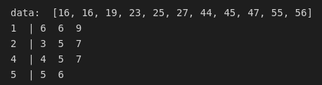
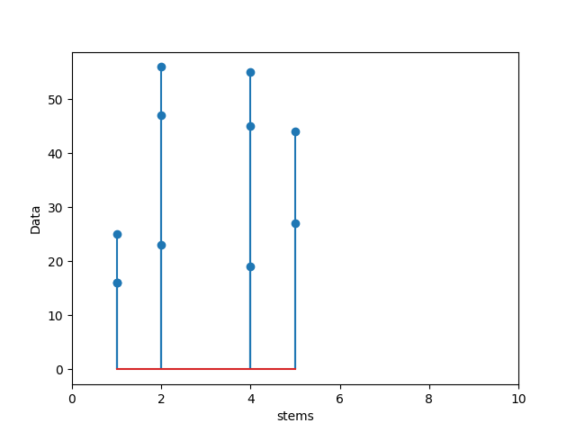
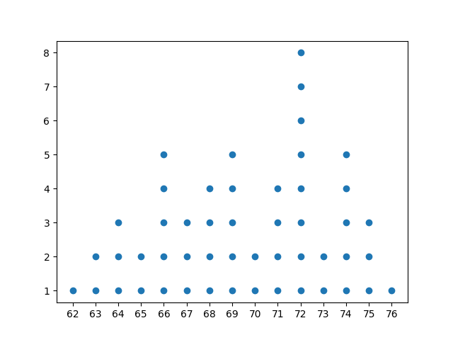
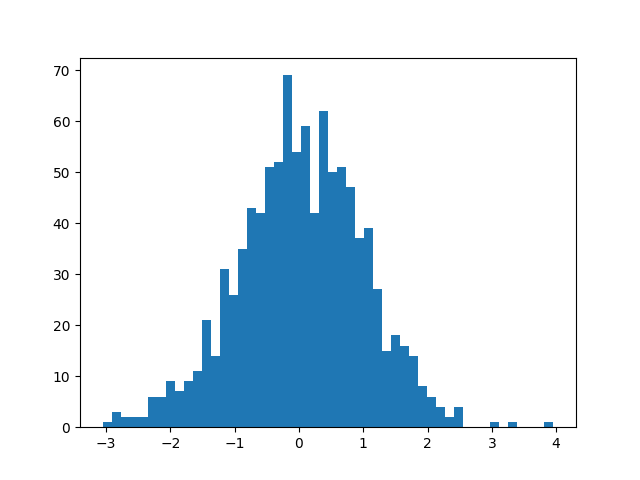

# 1-2 Pictorial and Tabular Methods in Descriptive Statistics

This graphs is to show some property of the data. So they are part of descriptive statistics.

## Stem-and-Leaf Display:
* Advantage:
* Disadvantage:

First image:

Second image:

## Dotplot:
* Advantage:
* Disadvantage:

## Histogram:
* Advantage:
* Disadvantage:

Frequency: number of times the value occurs

Relative frequency: frequency / number of all in the dataset

Frequency distribution: a tabulation of the frequencies and/or relative frequencies

We can use frequency or relative frequency of each interval as y value

